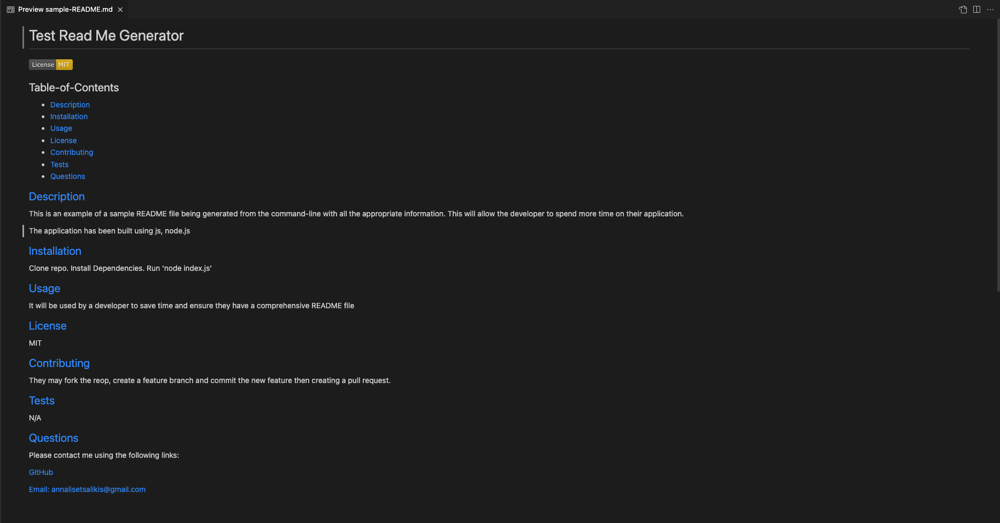

# Professional README Generator

## Description

When creating an open source project on GitHub, it’s important to have a high-quality README for the app. This should include what the app is for, how to use the app, how to install it, how to report issues, and how to make contributions. This weeks challenge required the creation of a command-line application to automatically generate a README.md file with all the appropriate information. This will allow the developer to spend more time on their application.

You can quickly and easily create a README file by using a command-line application to generate one. This allows the project creator to devote more time to working on the project.

The application is invoked by using the following command:

```bash
node index.js
```
A walkthrough video was created to demonstrate it in use.

The Github Repository can be found here: https://github.com/annalisedev/readmegenerator

## Video and Screenshot

Find a video demonstrating a walkthrough of the application here: https://drive.google.com/file/d/1K2KNVHf_AdMMxAk8Iu8H4niFfaEYX7Q0/view

A screenshot of the test README can be found in assets:


A gif of the walkthrough can be found in assets: <br>


## Support

Some external sources that supported me to understand the task and write the code are linked below. I also used the weekly activities considerably as I solved these questions. 

License Shields https://gist.github.com/lukas-h/2a5d00690736b4c3a7ba <br>
Code for rendering the License Badge https://stackoverflow.com/questions/67013842/trying-to-place-license-badge-within-readme-md-using-node-js-but-getting-error-a <br>
Support in creating the video submission https://coding-boot-camp.github.io/full-stack/computer-literacy/video-submission-guide <br>
How to remove the node_modules after gitignore file was lost https://www.tutorialspoint.com/how-to-ignore-a-previously-committed-file-in-git-repository 